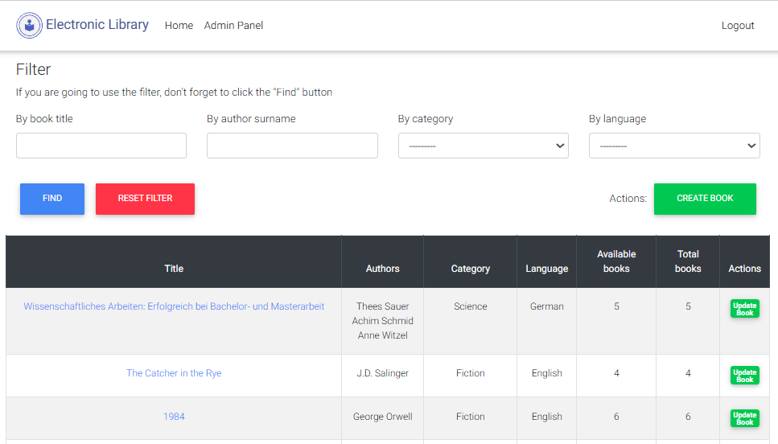

# Django Library Management System

## Understanding the application

* [Data model description](./docs/data_model.md)

## Running Library Management System locally

1. Clone/pull/download this repository
2. Create a virtualenv with `virtualenv env` (python3 -m venv env), activate it and install dependencies with `pip install -r requirements.txt`
3. Configure your .env variables
4. Prepare SQL queries for a local database (SQLLite3) with `python manage.py makemigrations` and execute them with `python manage.py migrate` commands
5. Create an operator (admin) with `python manage.py createsuperuser`. It will be able to log in and perform various operations with the catalog
6. Start the server: `python manage.py runserver`

You can then access electronic library here: http://localhost:8000

## In case you find a bug/suggested improvement for the Django Library Management System
Our issue tracker is available here: https://github.com/callbacksin/django-library-management-system/issues
