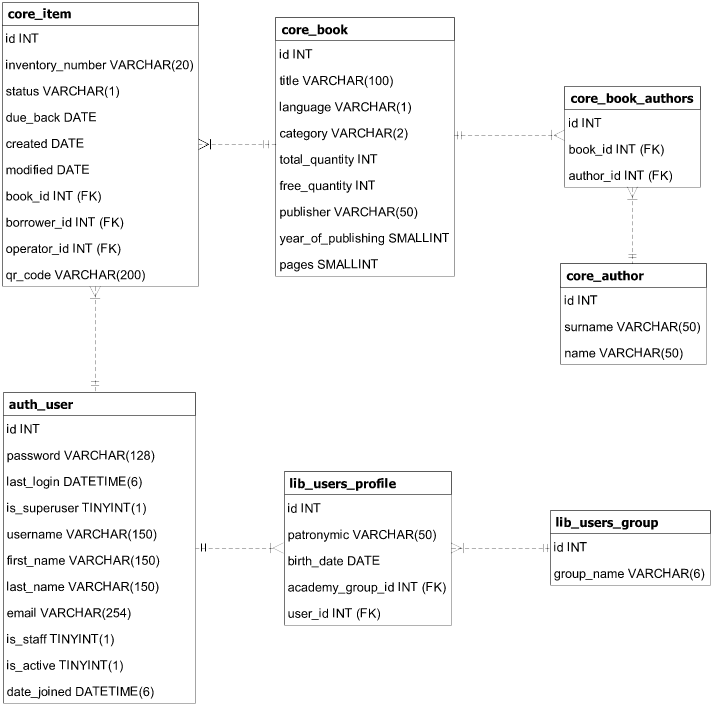

# Catalog data model
**Objectives:** The system should:
- Maintain consistent representation of data.
- Facilitate interaction between users and the catalog.
- Provide tools for analyzing and processing information while respecting relationships between library entities.
- Optimize information usage for efficiency.

We will focus on the catalog data model for now, which includes the following entities:
1. **Reader**  
    The **Reader** entity represents a user of the library system. Let's keep the following data about users:
    - First Name        
    - Last Name
    - Patronymic (optional, depending on region/culture)        
    - Creation Date
    - Last Login Date
    - Username
    - Email
    - Encrypted Password
    - Group (a foreign key reference to the Group entity)
2. **Group**  
    Initially the system was developed for university library. A student (user) belongs to one group. It does not change over time, except for cases then students continues to study at some other group. So, the relationship here is *1:N*. To make the system more universal, it can be changed. Let's say a group will represent detective's story enjoyers, other group - romantic story's lovers. I just do not know whether the field makes sense in these circumstances. Attributes:
    - Group Name
3. **Book Metadata**  
    The **Book Metadata** entity holds immutable data about a book. Attributes include:
    - Title
    - Authors (referencing the Author entity)
    - Publisher
    - Year of Publication
    - Page Count
    - Category (e.g., Fiction, Non-fiction, Science, etc.)
    - Language    
    To optimize performance and avoid recalculating the total number of book objects and available copies, there are 2 additional attributes:
    - Total Copies: The total number of book objects (physical copies) in the library for this particular book.
    - Available Copies: The number of copies that are currently available for borrowing (i.e., not borrowed or reserved).
4. **Book Item**  
    The **Book Item** represents a specific physical copy of a book. Attributes include:
    - Book Metadata ID (foreign key to Book Metadata)
    - Inventory Number (unique ID for each physical copy)
    - Status (e.g., Available, Borrowed, Reserved)
    - Issue Date (when the book was issued)
    - Return Date (when the book is expected or returned)
    - Borrowed By (foreign key to Reader, the user who borrowed the book)
5. **Author**  
    The **Author** entity represents the authors of books. A book may have multiple authors (especially technical one), and an author can write many books. Attributes:
    - Name (full name, I don't know whether it's worth splitting into first and last names)
6. **Library Operator Flag**  
    A **Library Operator** is a special user role who can modify the system's entities (e.g., adding, updating, or removing books/copies/users/etc). A regular user cannot perform these actions.
7. **Book Object History**  
    To track the history of a book's ownership, each book object will maintain a history of transactions, including changes in its status and borrower history. This will allow tracing the book's lifecycle over time.

## The data scheme
